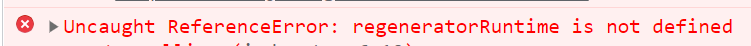
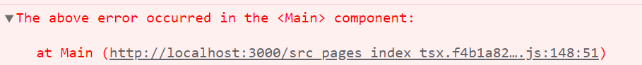
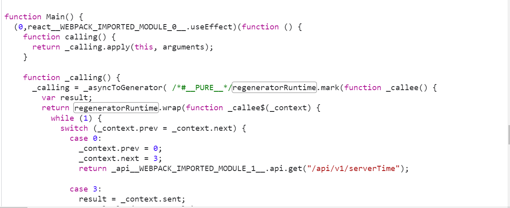
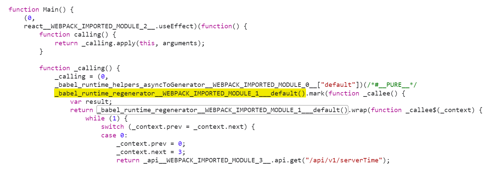

# regeneratorRuntime Error



<br/>

## 문제 발생

아래와 같이 `async` `await`을 사용해 api 통신을 하는데 `ReferenceError: regeneratorRuntime is not defined` 에러가 발생했다.

```tsx
function Main() {
	useEffect(() => {
		async function calling() {
			try {
				const result = await api.get("/api/a/b");
				return result;
			} catch (error) {
				console.log("error: ", error);
				return error;
			}
		}
		calling();
	}, []);
}
```

<br/>

바로 아래 해당 오류가 `Main` 컴포넌트에서 발생했음을 알려주는 로그가 있었고 오류를 추적할 수 있도록 경로를 제공해주고 있었다.



경로로 들어가보니



내가 호출한 `calling` 함수를 바벨이 `_asyncToGenerator`함수를 사용해 재정의한 후 반환하는데, 인자로`regeneratorRuntime`을 사용한 콜백함수를 전달하고 있는 모습을 확인할 수 있다.

[바벨 공식문서](https://babeljs.io/docs/en/babel-plugin-transform-runtime#regenerator-aliasing)에 따르면 `generator` (생성기) 함수나 비동기 함수를 사용할 때 바벨에 의해 `regeneratorRuntime`를 사용한 코드로 컴파일되는데, (`@babel/preset-env` 안에 포함된 `@babel/plugin-transform-regenerator`를 이용한다.) 이렇게 변환된 `regeneratorRuntime` 브라우저가 인식하지 못하는 것이다.

> 비동기 작업을 변환하는데 `switch`를 사용하고 있다니 신기.. [여기](https://yceffort.kr/2021/03/javascript-generator-regeneratorRuntime)에서 설명한 글을 읽고나니 대략 어떻게 동작하는지 감을 잡을 수 있었다!

<br />

## 해결 방법

`regeneratorRuntime`을 지원할 수 있도록 폴리필을 추가하면 해결할 수 있다!

> 바벨은 es6+ 문법을 es5 환경에서 동작할 수 있도록 문법적인 변환을 해주지만 es5에 존재하지않는 es6의 메서드나 생성자들까지 지원해주지는 않으므로 폴리필을 추가해주어야 한다.
> `@babel/preset-env`에서 지원해주지 않을까하여 [@babel/preset-env 에 포함된 플러그인 목록](https://github.com/babel/babel/blob/main/packages/babel-compat-data/scripts/data/plugin-features.js) 을 확인해보았는데 `regeneratorRuntime` 으로 변환해주는 `transform-regenerator`은 있지만 `regeneratorRuntime`에 대한 폴리필인 `regenerator-runtime`은 포함하고있지 않다.

<br />

폴리필을 추가하는 방법에는 몇가지가 있다.

### ❌ 1. @babel/polyfill 설치하기

> 바벨 7.4.0 버전부터 **deprecated** 됨
> 예전에는 이런 방법을 사용했다 라고 알고가는 용도로 작성함.

<br/>

이전에는 `@babel/polyfill`에 `regenerator-runtime/runtime`가 포함되어있어 앱 진입점 상단에 플러그인을 불러와 사용하였다.

> `@babel/polyfill`를 설치하면 `core-js` 와 `regenerator-runtime`이 설치되는 것을 확인할 수 있다.
>
> 

```javascript
// 앱 진입점 상단
import "@babel/pilyfill";

// or webpack.config.js
entry = ["@babel/polyfill", "./app.js"];
```

이렇게 import 해주면 `Promise`, `Set`, `Map`과 같은 메서드를 지원하기위한 폴리필이 **전역**에 추가된다. (전역 오염발생)

> `Promise`, `Set`, `Map`를 지원하지 않는 `Internet Explorer`의 콘솔에서 Promise를 찍어보면 폴리필로인해 정의된 메서드를 확인할 수 있다.

<br />

### 2. core-js, regenerator-runtime 설치하기

> 1번 방법과 같이 **전역 오염**이 발생한다.

[바벨 7.4.0 버전부터 `@babel/pilyfill`이 사용되지 않으면서](https://github.com/zloirock/core-js/blob/master/docs/2019-03-19-core-js-3-babel-and-a-look-into-the-future.md#babelpolyfill)
`core-js` 와 `regenerator-runtime`를 직접 설치해서 import 하도록 [변경되었다.](https://babeljs.io/docs/en/babel-polyfill)

```bash
yarn add core-js regenerator-runtime
```

```javascript
// 앱 진입점 상단
import "core-js/stable";
import "regenerator-runtime/runtime";
```

> **[`core-js/stable` 에서 stable은 무엇인가?](https://github.com/zloirock/core-js/blob/master/docs/2019-03-19-core-js-3-babel-and-a-look-into-the-future.md#packages-entry-points-and-modules-names)** > `core-js`: 모든 `core-js` 기능을 폴리필
> `core-js/stable`: ES, 웹표준에 맞춰 안정적인 기능만 폴리필
> `core-js/es`: ES에 맞춰 안정적인 기능만 폴리필

<br/>

### 3. @babel/preset-env의 useBuiltIns 옵션 설정하기

[`@babel/preset-env`의 `useBuiltIns`](https://babeljs.io/docs/en/babel-preset-env#usebuiltins) 옵션은 폴리필을 주입하는 방법을 설정할 수 있게 해준다.

`entry` | `usage` | `false` 세가지의 값이 있고 기본값은 `false`이다.
폴리필을 설정할 것이므로 `false`를 제외한 `entry` 혹은 `usage`를 사용하면 된다.

-   `entry`를 사용한 방법

```javascript
presets = [
    '@babel/env', { useBuiltIns: 'entry' },
],
```

`entry`의 경우 앱 진입점에서 불러온 `import "core-js/stable"; import "regenerator-runtime/runtime";` 코드를 브라우저 환경에 따라 필요한 모듈로 **대체** 하여 주입해준다.

```javascript
// 앱 진입점에 입력
import "core-js/stable";

// 대체된 코드 (브라우저 환경 예: chrome 71)
import "core-js/modules/es.array.unscopables.flat";
import "core-js/modules/es.array.unscopables.flat-map";
import "core-js/modules/es.object.from-entries";
import "core-js/modules/web.immediate";
```

`core-js/stable`를 import 하였지만 `core-js/stable`의 모듈 전체가 불러와지는게 아니라
chrome 71 브라우저에서 필요한 모듈들만 불러와지도록 import 코드가 대체되었다.
다른 브라우저로 실행하면 해당 브라우저에서 필요한 모듈들만 불러와질 것이다.

<br/>

- `usage`를 사용한 방법

```javascript
presets = [
    '@babel/env', { useBuiltIns: 'usage' },
],
```

`usage`는 브라우저에서 필요한 모듈을 앱 진입점이 아닌 해당 모듈이 필요한 파일의 상단에 추가한다.

```javascript
// a.js
var  set  =  new  Set ([1, 2, 3]);

// b.js
var array = Array.of(1, 2, 3);

// 변경된 코드 (브라우저 환경 예: IE 11)
// a.js
import 'core-js/modules/es.array.iterator';
import 'core-js/modules/es.object.to-string';
import 'core-js/modules/es.set';
var set = new Set([1, 2, 3]);

// b.js
// second file:
import 'core-js/modules/es.array.of';
var array = Array.of(1, 2, 3);
```

`entry`와 다르게 앱 진입점에 있는 import 문을 대체하는 것이 아니므로 진입점에서 `core-js`, `regenerator/runtime`을 불러올 필요가 없다.
또한 브라우저 환경에서 필요한 모듈을 모두 불러오는 것이 아니라 실제 사용한 코드에 필요한 모듈만 가져온다.

- 'corejs' 옵션 같이 사용하기.

`useBuiltIns: 'usage' | 'enrty'` 옵션을 사용할 때만 유효한 [`corejs` 옵션](https://babeljs.io/docs/en/babel-preset-env#corejs)이 있다.

```javascript
presets = [
    '@babel/env', { useBuiltIns: 'usage', corejs: '3.21' },
],
```

설치된 `core-js`의 버전을 명시해주면 `@babel/preser-env`가 core-js 버전에서 지원하는 폴리필을 주입한다.


<br/>

### 4. ✨@babel/plugin-transform-runtime✨

[`@babel/plugin-transform-runtime`](https://babeljs.io/docs/en/babel-plugin-transform-runtime#installation)를 사용한 방법이 가장 권장되는 방법이다.

```bash
yarn add -D @babel/plugin-transform-runtime
yarn add @babel/runtime
```

> 개발 환경에서는 `@babel/plugin-transform-runtime` 설정만으로도 `regeneratorRuntime`에 대한 설정이 완료될테지만 '런타임' 자체는  배포된 코드에 따라 달라지므로 프로덕션 dependency로 `@babel/runtime` 설치가 필요하다.
> 
> [`@babel/runtime` 문서](https://babeljs.io/docs/en/babel-runtime) 와 [`@babel/plugin-transform-runtime` 문서](https://babeljs.io/docs/en/babel-plugin-transform-runtime#why)에 따르면
> 컴파일된 결과물의 중복을 피하기 위해 `@babel/plugin-transform-runtime`이 `@babel/runtime`을 참조한다. 
> 즉 `@babel/plugin-transform-runtime`이 어떤 함수에 대한 참조를 할 때 `@babel/runtime` 버전으로 사용한다.
>
> ```javascript
> class Circle {}
>
> // 컴파일된 Circle
>function _classCallCheck(instance, Constructor) {
>  //...
>}
>
>var Circle = function Circle() {
>  _classCallCheck(this, Circle);
>};
>
> // @babel/plugin-transform-runtime 사용시 @babel/runtime 를 참조
>var _classCallCheck = require("@babel/runtime/helpers/classCallCheck");
>
>var Circle = function Circle() {
>  _classCallCheck(this, Circle);
>};
> ```
> *이 부분에 대해 여러차례 찾아보고 읽어보았지만 `@babel/runtime`를 참조하는 방법에 대한 것은 예제코드로 알겠는데 설명은 온전히 이해되지는 않는다* 😂

<br/>

플러그인 설치 후 바벨 설정 파일의 `plugins`에 추가해주면 `regeneratorRuntime is defined` 오류가 없어진다!

```javascript
plugins = [
    "@babel/plugin-transform-runtime"
],
```

그치만 플러그인 자체는 폴리필을 제공하지 않는다. (이미 폴리필 가능한 모든 api를 사용자가 제공한다고 가정하기 떄문)
폴리필을 지원하려면 [`corejs`옵션을 지정](https://babeljs.io/docs/en/babel-plugin-transform-runtime#options)할 수 있다.

```javascript
plugins = [
    ["@babel/plugin-transform-runtime", { corejs: 3 }]
],
```

`corejs`옵션을 사용하는 경우 `@babel/runtime` 종속성 설치를 `corejs` 버전에 맞춰 설치해줘야 한다!
- `corejs: false | 2 | 3`
- `false` -> `yarn add @babel/runtime`
- `2` -> `yarn add @babel/runtime-corejs2`
- `3` -> `yarn add @babel/runtime-corejs3`

>`@babel/preset-env`의 corejs 옵션과는 다르게 string이 아니고 `false, 2, 3` 중에서 지정이 가능하다. (`{version, proposals}`로 지정하는 방법은 같음)
> 또 `@babel/preset-env` 에서는 corejs 버전을 설정할 때 부버전 (`3`-> `3.21`로 지정) 을 권했는데 여기는 메인 버전만 지정한다.


이 방법의 가장 좋은 점은 [**전역 환경을 오염시키지 않는다**](https://babeljs.io/docs/en/babel-plugin-transform-runtime#technical-details)는 것이다. 

```javascript
// `regeneratorRuntime`로 변환된 코드는 전역 환경을 오염시킨다.
var _marked = [foo].map(regeneratorRuntime.mark);

function foo() {
  return regeneratorRuntime.wrap(/*...*/)
}

// `@babel/plugin-transform-runtime`를 사용한 경우 컴파일 결과
// 전역 환경을 오염시키지 않고 regenerator/runtime 을 사용할 수 있다.
var _regenerator = require("@babel/runtime/regenerator");
var _regenerator2 = _interopRequireDefault(_regenerator);

function _interopRequireDefault(obj) {
  return obj && obj.__esModule ? obj : { default: obj };
}

var _marked = [foo].map(_regenerator2.default.mark);

function foo() {
  return _regenerator2.default.wrap(/*...*/)
}
```

<br/>

## 마무리 

자 이렇게 4번 방법으로 **@babel/plugin-transform-runtime**을 적용하고 나니 `async``await`을 사용한 api 호출이 아주 잘 동작하였다.



`regeneratorRuntime` 부분이 `_babel_runtime_regenerator__WEBPACK_IMPORTED_MODULE_!___defualt()` 로 컴파일 되었다.

`@babel/plugin-transform-runtime`를 적용하지 않고 polyfill만 적용하였을 때는 `regeneratorRuntime`가 적용된 코드는 그대로이고 정의할 수 없다는 오류만 해결되었지만, `@babel/plugin-transform-runtime`를 사용하므로써 전역 오염을 일으키지 않고 폴리필 적용을 할 수 있었다!

<br/>
<br/>

## 참고

-   [https://babeljs.io/docs/en/babel-plugin-transform-regenerator](https://babeljs.io/docs/en/babel-plugin-transform-regenerator)
-   [https://babeljs.io/docs/en/babel-plugin-transform-runtime](https://babeljs.io/docs/en/babel-plugin-transform-runtime#regenerator-aliasing)
-   [https://andrew-flower.com/blog/Async-Await-with-React](https://andrew-flower.com/blog/Async-Await-with-React)
-   [https://yceffort.kr/2021/03/javascript-generator-regeneratorRuntime](https://yceffort.kr/2021/03/javascript-generator-regeneratorRuntime)
-   [https://github.com/babel/babel/blob/main/packages/babel-compat-data/scripts/data/plugin-features.js](https://github.com/babel/babel/blob/main/packages/babel-compat-data/scripts/data/plugin-features.js)
-   [https://github.com/zloirock/core-js#commonjs-api](https://github.com/zloirock/core-js#commonjs-api)
