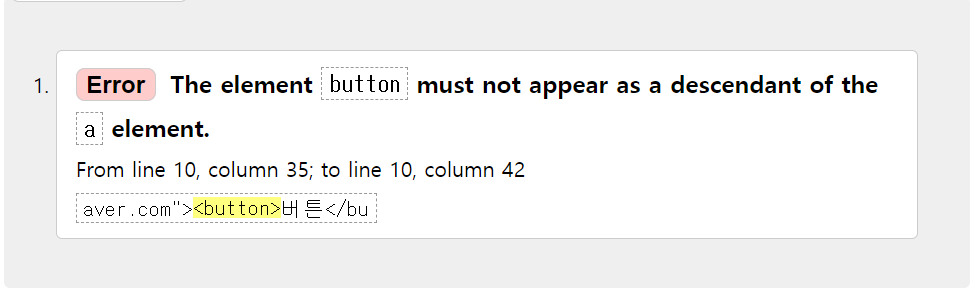
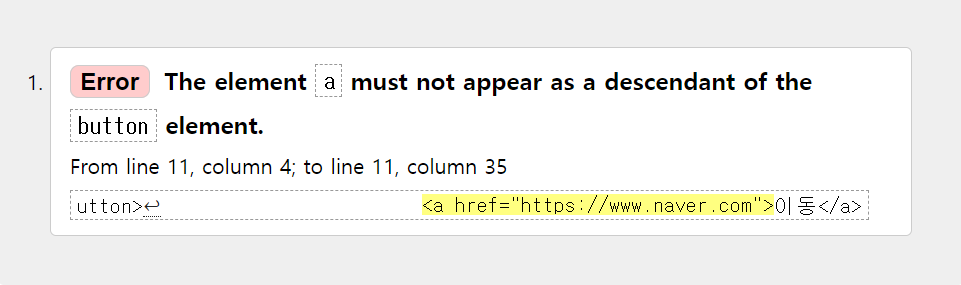

## button을 a태그로 감싸면 안되나요?

---

우연히 인터넷에서 위와 같은 질문을 보았고

`button`과 `a` 태그 모두 이벤트를 가지고 있는 태그들이라 중첩해서 사용하면 이벤트가 중첩되어 분명히 문제가 될 것 같다는 생각은 들었지만 조금 더 자세히 알아보았다.

<br/>

우선 직접 코드를 짠 후 [w3c](https://validator.w3.org/)의 마크업 검사기로 확인해보았다.

```html
<a href="https://www.naver.com"><button>버튼</button></a>
```

### 검사 결과



`button`안에 `a` 태그를 넣는 실험해보았다.

```html
<button>
	<a href="https://www.naver.com">이동</a>
</button>
```



역시 같은 오류가 난다.

<br/>

### 스펙 문서

[A element html.spec](https://html.spec.whatwg.org/multipage/text-level-semantics.html#the-a-element) 문서를 보면

([BUTTON element html.spec](https://html.spec.whatwg.org/multipage/form-elements.html#the-button-element)
문서에도 같은 내용이 있다.
)

a 태그의 `Content model`항목에 어떤 자식 및 하위 항목들이 포함되어야 하는지 안내가 되어있는데,

여기에 `interactive content`는 하위 항목으로 사용할 수 없다고 설명하고있다.

> `interactive content`는 사용자 상호 작용을위한 컨텐츠이다.
> (href 속성을 가지는)`a`, `button`, `iframe`, `textarea`, `tabindex` 속성을 가지는 태그 등이 포함된다.

<br/>

### 정리

대화형 컨텐츠라 일컬어지는 `interactive content` 요소는 각각 사용자 상호 작용을 위한 행동을 가지고 있으므로, 이런 요소들을 중첩하여 사용하는 경우 접근성 측면에서 사용자에게 혼란을 야기할 수 있으니 주의해야 한다.

> 자료를 찾으면서 최근 읽었던 아티클에서 이야기한 웹 접근성과 웹 표준에 대한 내용이 생각나 다시 한번 읽어 보면서 관련 내용도 찾아보았는데 나중에 이 부분도 정리해봐야겠다.
>
> - [2022년 웹 개발에서 고려해야 할 환경](https://engineering.linecorp.com/ko/blog/the-baseline-for-web-development-in-2022/)
> - https://seulbinim.github.io/WSA/accessibility.html#%EC%9B%B9%EC%A0%91%EA%B7%BC%EC%84%B1%EC%9D%98-%EA%B0%9C%EC%9A%94

<br/>

### 참고

-   https://stackoverflow.com/questions/6393827/can-i-nest-a-button-element-inside-an-a-using-html5
-   https://html.spec.whatwg.org/ 
- https://developer.mozilla.org/ko/docs/Web/Guide/HTML/Content_categories#%EB%8C%80%ED%99%94%ED%98%95_%EC%BD%98%ED%85%90%EC%B8%A0
